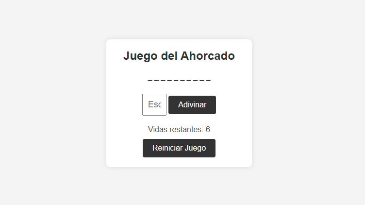

# Juego del Ahorcado Interactivo

*Este es un proyecto de juego del ahorcado simple y funcional desarrollado con HTML, CSS y JavaScript. El juego permite a los usuarios adivinar palabras letra por letra, con un límite de intentos antes de perder. Es ideal para practicar habilidades en programación de juegos y manipulación del DOM en JavaScript.
